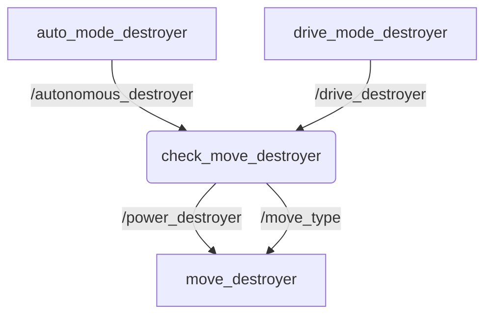

# Tugas Day 2 SEKURO 18

## Identitas Cakru
* **Nama:** Wesley Lianto
* **NIM:** 13525100
* **Jurusan:** Teknik Informatika
* **Departemen:** Programming

## Penjelasan Program
Program ini adalah dasar dari kontrol sebuah robot. Program dibuat dengzn menggunakan framework ROS 2 Humble dan bahasa pemrograman C++.

Pada dasarnya, ada 2 mode pengoperasian robot, yaitu auto dan drive. Auto mengendalikan robot secara random dan acak, sedangkan mode drive memanfaatkan input keyboard untuk menggerakkan robot.

Gambar berikut merupakan alur komunikasi data antar node pada sistem gerak robot ini. 



## Dependencies
Pastikan pada environment/komputer sudah terinstall:
* Linux (Ubuntu 22.04)
* ROS 2 Humble
* Compiler C++ (g++/gcc)
* Package ROS:
  * `rclcpp`
  * `geometry_msgs`
  * `std_msgs`
* `rmw_cyclonedds_cpp` (untuk penggunaan lintas komputer dalam satu network)

## Cara Menjalankan Program
1. Buka terminal pada root package ini, lalu build dengan menggunakan ```bash colcon build```.
2. Lakukan ```bash source install/setup.bash``` supaya file dikenali untuk **setiap terminal** yang dibuka.

### Opsi 1: Jalankan secara manual
3. Terminal 1: 
```bash
  ros2 run destroyer move_destroyer
  ```
4. Terminal 2:
```bash
  ros2 run destroyer check_move_destroyer
  ```
5. Terminal 3:
```bash
  ros2 run destroyer drive_mode_destroyer
  ```

## Opsi 2: Jalankan secara otomatis
3. Buka terminal,
```bash
ros2 launch destroyer switch_on.launch.py
```

## Video Penjelasan Singkat
https://youtu.be/a-A2YaB4TO4