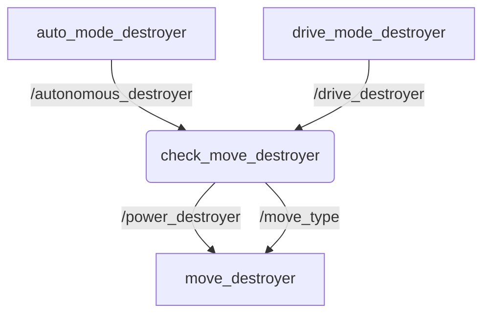

# Tugas Day 2 SEKURO 18

## Identitas Cakru
* **Nama:** Wesley Lianto
* **NIM:** 13525100
* **Jurusan:** Teknik Informatika
* **Departemen:** Programming

## Penjelasan Program
Program ini adalah dasar dari kontrol sebuah robot. Program dibuat dengzn menggunakan framework ROS 2 Humble dan bahasa pemrograman C++.

Pada dasarnya, ada 2 mode pengoperasian robot, yaitu auto dan drive. Auto mengendalikan robot secara random dan acak, sedangkan mode drive memanfaatkan input keyboard untuk menggerakkan robot.

Gambar berikut merupakan alur komunikasi data antar node pada sistem gerak robot ini. 

